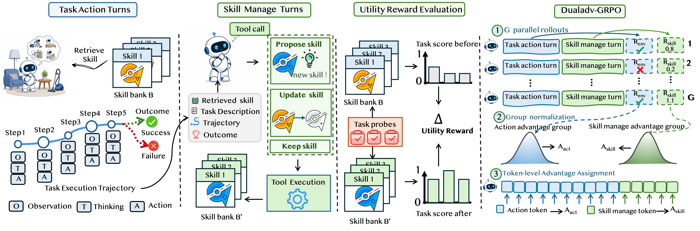

# SkillMaster: Toward Autonomous Skill Mastery in LLM Agents


## Overview

SkillMaster enables LLM agents to autonomously acquire and refine skills from experience, transforming skills from externally managed resources into self-improving capabilities.


##  Key Features

- **Autonomous Skill Mastery**: Skills are no longer externally managed by teachers, hand-designed rules, or auxiliary modules. The agent learns to actively improve its own skill bank from experience, transforming skills from static resources into a self-improving capability.

- **Trajectory-Informed Skill Review**: After each episode, the agent reflects on its own trajectory and autonomously decides—via tool-integrated reasoning—whether to propose, update, or retain skills, unifying task execution and skill management in a single learned policy.

- **Counterfactual Skill Utility Reward**: Each candidate skill edit is evaluated by its measurable downstream effects on related probe tasks: increasing success on previously failing tasks and reducing steps on already-solvable tasks, providing an explicit signal for skill-editing quality.

- **Decoupled Optimization**: Task-solving actions and skill-editing decisions are optimized with separately normalized advantages, then merged into a unified loss with a tunable weight, enabling stable joint training without objective interference.

## Model and Dataset Download
The anonymous release does not include:
  - full training datasets
  - processed SFT datasets
  - SFT checkpoints
  - RL checkpoints

These resources will be released after paper acceptance.

## Installation
### Install veRL
```bash
conda create -n verl-agent python==3.12 -y
conda activate verl-agent

pip3 install vllm==0.11.0

pip3 install flash-attn==2.7.4.post1 --no-build-isolation --no-cache-dir
pip install -e .
```

### Install Supported Environments
> ⚠️ **Important:** 
To run an agent in any of these environments, you must first install and configure the corresponding environment. We strongly recommend installing ***each environment in its own dedicated conda environment*** to avoid potential package version conflicts.

#### 1. ALFWorld
Install with pip:
```bash
pip3 install gymnasium==0.29.1
pip3 install stable-baselines3==2.6.0
pip install alfworld
```

Download PDDL & Game files and pre-trained MaskRCNN detector (will be stored in `~/.cache/alfworld/`):
```bash
alfworld-download -f
```

Use `--extra` to download pre-trained checkpoints and seq2seq data.

Play a Textworld game:
```bash
alfworld-play-tw
```
---

#### 2. WebShop
WebShop requires Python <=3.10, so begin by creating a new `verl-agent-webshop` environment
```bash
conda create -n verl-agent-webshop python==3.10 -y
conda activate verl-agent-webshop
```

Install WebShop
```bash
cd ./agent_system/environments/env_package/webshop/webshop
./setup.sh -d all
```

Note: If you encounter issues with gdown, you may need to visit `https://drive.google.com/`, get your Google Drive cookie, and paste it into `.cache/gdown/cookies.txt`.
Or you may need to manually download the files.

After WebShop is installed, return to the root directory of the repository and install the verl package in `verl-agent`:
```bash
cd /path/to/Skill-Master
pip3 install torch==2.6.0 --index-url https://download.pytorch.org/whl/cu124
pip3 install flash-attn==2.7.4.post1 --no-build-isolation
pip3 install -e .
pip3 install vllm==0.8.2
# spacy 3.7.2 requires typer<0.10.0,>=0.3.0, but you have typer 0.15.2 which is incompatible.
# weasel 0.3.4 requires typer<0.10.0,>=0.3.0, but you have typer 0.15.2 which is incompatible.
```
The warnings can be safely ignored.

---

#### 3. Search
```bash
cd ./agent_system/environments/env_package/search/third_party
pip install -e .
pip install gym==0.26.2
```

Prepare dataset (data will be saved at `~/data/searchR1_processed_direct`):
```bash
cd /path/to/Skill-Master
python examples/data_preprocess/preprocess_search_r1_dataset.py
```


Since faiss-gpu is not available via pip, we setup a separate conda environment for the local retrieval server. Running this server will use around 6GB of GPU memory per GPU, so make sure to account for this in your training run configuration. Build Retriever environments:
```bash
# Create and activate the retriever environment with Python 3.10
conda create -n retriever python=3.10 -y
conda activate retriever

# Install PyTorch (with GPU support) and related libraries
conda install numpy==1.26.4 # needed to stop incompatible version of numpy from being installed via pip
pip install torch==2.6.0 torchvision==0.21.0 torchaudio==2.6.0 --index-url https://download.pytorch.org/whl/cu124

# Install other Python packages
pip install transformers datasets pyserini huggingface_hub

# Install the GPU version of faiss
conda install faiss-gpu==1.8.0 -c pytorch -c nvidia -y

# Install the API service framework
pip install uvicorn fastapi
```

Download the index:
```bash
conda activate retriever

local_dir=~/data/searchR1
python examples/search/searchr1_download.py --local_dir $local_dir
cat $local_dir/part_* > $local_dir/e5_Flat.index
gzip -d $local_dir/wiki-18.jsonl.gz
```

Start the local flat e5 retrieval server: 
```bash
conda activate retriever

# redirect the output to a file to avoid cluttering the terminal
# we have observed outputting to the terminal causing spikes in server response times
bash examples/search/retriever/retrieval_launch.sh > retrieval_server.log 
```

## RL Training

### ALFWorld

```bash
export MODEL_PATH=/path/to/sft_checkpoint
export BASE_SKILL_BANK_PATH=memory_data/alfworld/claude_style_skills.json
export SKILL_BANK_PATH=/path/to/runtime_skill_bank.json
export ALFWORLD_PROBE_GAMEFILES_PATH=data/alfworld_game_json/alfworld_train_gamefiles.json

bash examples/grpo_trainer/run_alfworld_skill_tool_rollout.sh vllm \
  trainer.n_gpus_per_node=8
```


### WebShop

```bash
export MODEL_PATH=/path/to/sft_checkpoint
export BASE_SKILL_BANK_PATH=memory_data/webshop/claude_style_skills_minimal.json
export SKILL_BANK_PATH=/path/to/runtime_skill_bank.json

bash examples/grpo_trainer/run_webshop_skill_tool_rollout.sh vllm \
  trainer.n_gpus_per_node=8
```


## Acknowledgement

We thank the open-source community and the following projects for making this work possible:

- [verl-agent](https://github.com/langfengQ/verl-agent)
- [LLaMA-Factory](https://github.com/hiyouga/LLaMA-Factory)
- [Qwen](https://github.com/QwenLM/Qwen)
- [SkillRL](https://github.com/aiming-lab/SkillRL)
- [ALFWorld](https://github.com/alfworld/alfworld)
- [WebShop](https://github.com/princeton-nlp/WebShop)
- [Search-R1](https://github.com/PeterGriffinJin/Search-R1)
